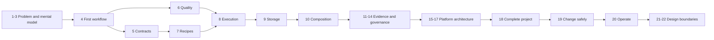

# Chapter dependency and learning map

The first four chapters are sufficient to explain DataRaft and run an in-memory product. Storage appears only after the acceptance model is clear. Part VI then turns the concepts into a runnable local platform, changes it deliberately, and adds an operating routine before the final design chapters.
