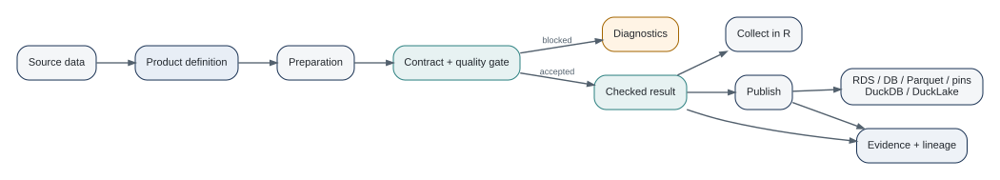

# Welcome {.unnumbered}

::: {.hero}
[Data Platforms with R]{.hero-title}

[From scripts to governed data products with DataRaft]{.hero-subtitle}

[A practical guide to turning recurring R data work into data products that state what they expect, check what they receive, record what happened, and can be published through interchangeable storage and metadata components.]{.lede}
:::

DataRaft is an R package family for **checked data products**. The core idea is deliberately smaller than a general data platform: define a named product, describe its contract, prepare its data, run quality checks, and keep evidence about the result. Storage, catalogs, dbt, metrics, and IDE tooling are composed around that core when they are useful.

This book teaches the method as well as the software. It follows the practical progression used by books such as *R for Data Science* and *Tidy Modeling with R*: see the whole workflow early, then return to each piece with more detail [@wickham2023r4ds; @kuhn2022tmwr]. It also borrows the architectural progression of logical data management writing: start with the problem, separate logical meaning from physical location, then add governance and operations [@gardner2025logical].

::: {.callout-note title="Three ways to read this book"}
**New to DataRaft?** Start with Chapter 1 and continue in order.

**Want to build something now?** Jump to Chapter 4, then return to contracts and quality.

**Already using DataRaft?** Use Parts IV and V as an architecture and operations guide.
:::

## The whole idea in one picture

The diagram is a conceptual summary of the verified current implementation. The product definition is the stable center. Sources, preparation, contracts, and quality rules are composed before execution. A successful run can remain in memory or be published to an adapter or lake. Diagnostics, lineage, and metadata are evidence around the delivery rather than a separate workflow.

{#fig-mental-model fig-alt="A left-to-right flow from source data to a product definition, preparation, a contract and quality gate, then either diagnostics for blocked runs or a checked result that can be collected, published, and accompanied by evidence and lineage."}

## What you will build

The recurring example is a small insurance reporting domain with policies, brokers, and payments. We begin with an in-memory policy delivery. Later we make expectations explicit, add preparation and lookups, retain releases, inspect lineage, and finally assemble a small platform-shaped project. The example data is synthetic and lives in `data/`.

## What is implemented today

This book treats the current code as the source of truth. At the time of this audit, the umbrella package is `dataraft` 0.1.0.9006. The active core packages are `dataraft.core`, `dataraft.adapters`, and `dataraft.lake`. `dataraft.metrics`, `dataraft.dbt`, and `dataraft.ide` are explicitly experimental. The separate `dataraft.catalog` repository has moved and is no longer an active R package; its current catalog responsibilities live in `dataraft.adapters`. The Positron extension is optional editor tooling.

The repository audit used to write this book is included in `AUDIT.md`.
