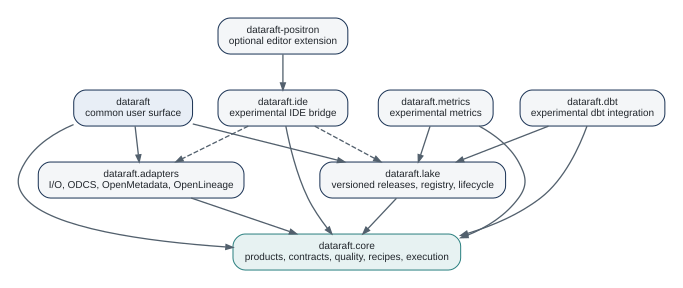

# The DataRaft Architecture {#sec-architecture}

The package family is modular, but readers should not have to understand every repository before using the framework.

## The beginner's stack

For an in-memory checked delivery, `dataraft.core` is enough. The `dataraft` metapackage installs and reexports the common surface so most users can start there.

When the workflow needs durable I/O, add one of two layers:

- `dataraft.adapters` for files, databases, APIs, Parquet, pins, and metadata integrations;
- `dataraft.lake` for governed versioned releases backed by DuckDB or DuckLake.

The remaining packages are optional extensions.

{#fig-package-architecture fig-alt="A package dependency diagram. dataraft exposes the common surface, dataraft.core holds the logical model, adapters and lake extend core, metrics and dbt are experimental extensions, and the Positron extension uses the experimental IDE bridge."}

## Core responsibilities

`dataraft.core` owns the logical model. Its current public API includes product construction, contracts, recipes, quality rules, diagnostics, governance policies, ports, SLAs, lineage, and execution protocols.

This is an important architectural boundary. Catalog integrations were moved out of core and now belong exclusively to `dataraft.adapters`. The former `dataraft.catalog` repository is inactive and points users to adapters.

## Extension protocols

The codebase uses S3 methods for extension points such as reading sources, writing targets, inspecting components, checking capabilities, and publishing metadata. The package family can therefore add physical implementations without changing the logical product constructors.

That separation is the R equivalent of an interface boundary. A product can ask for a target without knowing whether the target writes RDS files, a database table, Parquet, pins, Iceberg, or a governed lake.

## Stability matters more than package count

The metapackage intentionally exports a smaller common surface than `dataraft.core`. Advanced functions remain available from component namespaces. That keeps the beginner-facing API narrow while allowing specialist functionality to evolve.

Current status from the repository audit:

| Component | Status | Primary role |
|---|---|---|
| `dataraft` | Implemented | Common entry point and reexports |
| `dataraft.core` | Implemented | Logical product model and execution |
| `dataraft.adapters` | Implemented | External sources, targets, catalogs |
| `dataraft.lake` | Implemented | Versioned governed releases |
| `dataraft.metrics` | Experimental | Retained metric/report evidence |
| `dataraft.dbt` | Experimental | dbt execution/artifact bridge |
| `dataraft.ide` | Experimental | Bounded metadata bridge |
| `dataraft-positron` | Optional | Positron visual tooling |
| `dataraft.catalog` | Moved | Historical repository only |

## Implementation map

The package boundaries can be traced to stable source locations. These references use repository-relative paths and symbol names rather than line numbers so they remain useful as files evolve.

| Responsibility | Repository path | Key symbols |
|---|---|---|
| product definition | `dataraft.core/R/products.R` | `dr_product()`, `dr_model()` |
| contracts and rule definitions | `dataraft.core/R/contracts.R`, `R/contract-composition.R` | `dr_contract()`, `dr_quality_rule()`, `dr_contract_meta()`, `dr_contract_policy()` |
| preparation | `dataraft.core/R/recipe.R` | `dr_recipe()`, `dr_step_*()` |
| execution and collection | `dataraft.core/R/execution.R` | `dr_run()`, `dr_publish()`, `dr_collect()` |
| diagnostics | `dataraft.core/R/review.R`, `R/last-failure.R` | `dr_review()`, `dr_last_failure()` |
| governance interfaces | `dataraft.core/R/governance.R`, `R/ports.R`, `R/sla.R` | `dr_policy()`, `dr_output()`, `dr_sla()` |
| local and external adapters | `dataraft.adapters/R/adapter-*.R` | `dr_source_*()`, `dr_target_*()` |
| governed lake publication | `dataraft.lake/R/target-lake.R`, `R/registry.R` | `dr_target_lake()`, release registry functions |
| metadata integrations | `dataraft.adapters/R/catalog-*.R` | OpenMetadata and OpenLineage adapters |
| IDE bridge | `dataraft.ide/R/bridge.R`, `R/context.R` | `ide_request()`, `ide_context()` |

This map is not a second reference manual. It is a guide to where architectural responsibilities live when you need to inspect implementation details.

## Why this modularity matters

The package boundaries let a team adopt DataRaft without committing to the complete architecture. A local analyst can use core only. A team can add RDS publication next. A platform team can later introduce DuckLake, a PostgreSQL registry, S3 storage, OpenMetadata, or OpenLineage.

That is the architecture principle we will reuse throughout the book: **keep the logical contract stable while allowing the physical implementation to change**.

## Where next

The architecture is easier to understand after seeing one complete run. Part II deliberately returns to a tiny local product before adding more package boundaries.

## Exercises

1. Starting from the package diagram, identify the smallest package set needed for an in-memory checked delivery, a versioned RDS delivery, and a lake-backed delivery.
2. Choose one experimental component and explain why keeping it outside `dataraft.core` reduces coupling for a beginner.
3. Find one feature in the package map that belongs to an adapter rather than the core. Describe the extension boundary in terms of inputs and outputs.

