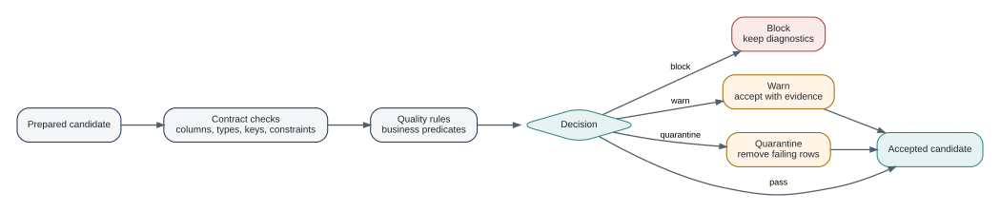

# Data Quality as an Execution Gate {#sec-quality}

Contracts describe expected structure. Quality rules ask whether the current delivery is acceptable.

## Row predicates

The shortest form is a one-sided formula:

```{.r}
policies <- dr_product("policies") |>
  dr_add_quality(~ premium >= 0)
```

For formula rules, the current implementation derives a label from the expression when no explicit name is supplied.

For a reusable rule, use `dataraft.core::dr_quality_rule()`:

```{.r}
positive_premium <- dataraft.core::dr_quality_rule(
  "positive_premium",
  ~ premium >= 0,
  action = "block",
  threshold = 0,
  dimension = "accuracy"
)
```

## Block, warn, quarantine

The audited API supports three actions:

- `block`: the failed rule prevents acceptance or publication;
- `warn`: the delivery may proceed but retains a warning state;
- `quarantine`: failing rows are removed before writing and retained locally on the result.

Quarantine is intentionally narrower. It is supported for native row formulas. It is not a generic way to ignore failed checks.

## Thresholds

A threshold is the permitted fraction of failed test units from 0 to 1. A zero threshold means every evaluated unit must pass.

This is useful when a rule represents tolerable data noise, but thresholds can also hide deterioration. A practical pattern is to use blocking rules for identity and structural invariants, warnings for monitored drift, and quarantine only when removing individual rows has a well-defined business meaning.

## Pointblank is optional

DataRaft has optional pointblank integration. Formula rules can use the pointblank engine, and `dataraft.core::dr_pointblank_checks()` can wrap a custom pointblank agent. The package remains usable without pointblank.

That boundary is intentional: DataRaft owns the quality gate and evidence model, while a specialized quality engine can provide richer checks.

{#fig-quality-gate fig-alt="A flow from a prepared candidate through contract checks and quality rules to a decision. Failing rules may block, warn, or quarantine, while passing rules produce an accepted candidate."}

## Debug the failure, not the symptom

A blocked result is designed to be inspected:

```{.r}
failed <- dr_run(
  policies,
  data = data.frame(policy_id = 1:3, premium = c(120, -5, 80)),
  write = FALSE,
  stop_on_failure = FALSE
)

dr_quality_report(failed)
dataraft.core::dr_quality_rows(failed)
```

If a failed result was lost inside a pipe, `dr_last_failure()` retains the most recent execution error carrying a result in the current R session. `dataraft.core::dr_review()` can open affected rows, the report, or lineage in an IDE viewer.

::: {.callout-important title="Quality evidence is part of the product story"}
A quality rule is not useful only when it passes. The failed result, affected rows, rule identifiers, and retained evidence are what make remediation explainable.
:::

## Design checks around decisions

A quality rule is valuable only if its result changes what happens next. Before writing a rule, ask what a failure means. DataRaft's three actions make this decision explicit.

`block` says that the candidate cannot be accepted under the current rule. `warn` records a problem but permits the delivery. `quarantine` removes failing rows before writing and retains the rejected rows locally on the result. Quarantine is intentionally narrower than a generic error-handling system: it is available for native row predicates where DataRaft can identify the failing rows.

Thresholds answer a different question. They specify the permitted fraction of failed test units. A threshold of zero requires every tested unit to pass. A non-zero threshold can be appropriate for a genuinely statistical tolerance, but it should not become a convenient way to silence a poorly understood source problem.

### Structural and semantic checks

Contracts already provide structural checks: names, types, required fields, keys, and configured constraints. Quality rules are a good place for domain assertions that need the values themselves.

```r
checks <- list(
  premium_non_negative = dataraft.core::dr_quality_rule(
    "premium_non_negative",
    ~ premium >= 0,
    action = "block"
  ),
  broker_present = dataraft.core::dr_quality_rule(
    "broker_present",
    ~ !is.na(broker_id),
    action = "warn"
  )
)
```

The distinction is useful in diagnostics. A missing required column describes a broken interface. A negative premium describes data that violates a business expectation. Both may block a delivery, but they point to different owners and different fixes.

### Optional Pointblank execution

Pointblank is an optional engine, not the conceptual owner of quality in DataRaft. Formula rules can use the Pointblank engine, and `dataraft.core::dr_pointblank_checks()` can wrap a custom agent. The core publication model remains DataRaft's: checks produce evidence and their configured policy determines whether a candidate can be accepted.

This separation lets a team use Pointblank where its validation vocabulary is helpful without forcing every DataRaft user to install it.

::: {.callout-tip title="Try it"}
Create three copies of the same rule with `block`, `warn`, and `quarantine`. Run each against a table containing one bad row. Compare status, quality evidence, and the data that can be collected or published. That experiment makes the policy semantics more concrete than memorizing the action names.
:::


## Where next

Contracts and quality define the acceptance boundary. The next part asks how preparation and execution reach that boundary without turning the product definition into one opaque script.

## Exercises

1. Implement the same business rule once as a blocking check and once as a warning. Compare the publication decision.
2. Create a rule with a non-zero threshold. Use a small table so you can predict the exact failed fraction before executing it.
3. Design one rule that should be quarantining rather than blocking. State what downstream consumer behavior makes quarantine reasonable in that case.

