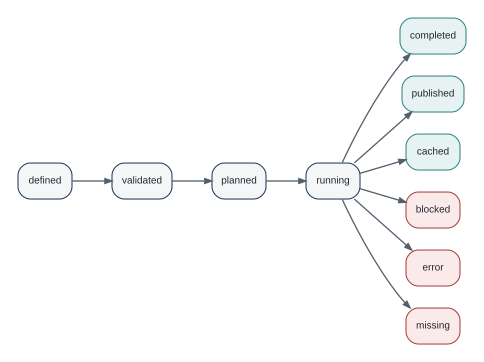

# Execution: Validate, Run, Collect, Publish {#sec-execution}

The current execution model is centered on `dr_run()`. Earlier development concepts such as `dr_trial()` have been removed from the namespace and should not appear in new examples.

## Run

For a product, `dr_run()` can replace execution-time `data` or named `sources`, validate the definition, execute the target protocol, normalize result status, retain metadata, and optionally stop on failure.

The most useful development pattern is:

```{.r}
result <- dr_run(
  product,
  data = delivery,
  write = FALSE,
  stop_on_failure = FALSE
)
```

This asks DataRaft to perform the checks while avoiding the configured DataRaft writer.

## Collect

`dr_collect()` returns accepted data from a successful run. It refuses blocked and error results. For lake-backed runs it reopens or reads the exact pinned release when necessary.

That makes collection an explicit trust boundary: the user is asking for the accepted result, not the candidate that happened to exist before checks.

## Publish

`dr_publish()` requires or derives a target, then delegates to `dr_run()` with writing enabled.

```{.r}
result <- dr_publish(product, to = target)
```

Publication is not simply `saveRDS()`. The target protocol receives the already composed product context and returns output metadata. Different targets have different transaction guarantees.

## Result lifecycle

{#fig-lifecycle fig-alt="A lifecycle diagram from defined to validated, planned, and running, with terminal states completed, published, cached, blocked, error, or missing."}

The core implementation records lifecycle entries and normalized status metadata. Backends can add richer durable evidence.

## Determinism and volatile rules

The code distinguishes volatile or dynamic checks from stable definitions. Volatile checks cannot safely authorize cached reuse in the lake path. This is a useful general principle: reproducibility claims should be limited to what the system can actually fingerprint and replay.

## Multiple outputs

Current core code supports output ports. The first output is primary. Later outputs are written sequentially. Publication is **not atomic across destinations**. If a later output fails, earlier committed outputs remain committed and the result records per-port status. `dataraft.core::dr_retry_ports()` can resume unpublished secondary outputs from the original in-memory result.

This is an example of an important book theme: DataRaft tries to make physical guarantees explicit rather than pretending that different storage systems share one transaction.

## The execution model has two independent choices

It helps to separate two questions that are easy to mix together.

First, *should the workflow write?* `dr_run(..., write = FALSE)` executes the product without its configured writer. `dr_run()` with writing enabled executes the configured target. `dr_publish()` is the publication-oriented entry point and requires or resolves a destination.

Second, *should a failure become an R error immediately?* `stop_on_failure = TRUE`, the default, raises when the final status is not successful. `stop_on_failure = FALSE` returns the failed result so that you can inspect it directly.

Those two choices create useful modes:

| Intent | Write | Stop on failure | Typical use |
|---|---:|---:|---|
| explore a definition | no | no | interactive diagnosis |
| assert a definition | no | yes | tests and CI |
| publish a delivery | yes | yes | scheduled production path |
| inspect a failed publication attempt | yes | no | controlled operational diagnosis |

### One graph, one execution context

Products can depend on products. During one root execution, shared dependencies are evaluated once and their results are reused within that execution context. This is different from durable release caching. Session-local graph reuse prevents duplicate work inside one run; lake caching is a separate, explicit feature with stricter requirements.

The result carries lifecycle metadata with states such as `defined`, `validated`, `planned`, `running`, and the final status. Current final statuses include `completed`, `published`, `cached`, `blocked`, `error`, and `missing`. Do not write operational code that treats every non-error string as success. Successful collection is deliberately limited to accepted statuses.

### Determinism and caching

When a lake target reuses a prior release with caching, the definition needs a `code_version`. Dynamic source state that cannot be fingerprinted prevents cache reuse, and volatile or live-reference checks cannot authorize reuse. These restrictions are useful: a cache is trustworthy only when DataRaft can identify what was reused.

This is also why the book does not describe DataRaft caching as a general-purpose build cache. It is release reuse under explicit reproducibility conditions.

### Failures are data for diagnosis

A blocked result and an execution error are different. A blocked result says the workflow ran far enough to determine that its acceptance rules failed. An execution error says the workflow could not complete the work needed to make that decision. The result model preserves this distinction so that an operator can decide whether to fix data, a definition, or infrastructure.

::: {.callout-tip title="Try it"}
Run the same failing product once with the default `stop_on_failure = TRUE` and once with `FALSE`. In the first case, catch the condition and inspect `condition$result`. In the second, save the returned result. Compare both with `dr_last_failure()`. The underlying evidence should tell the same story even though control flow differs.
:::

## Exercises

1. For a single product, write down what changes between `dr_validate()`, `dr_run(write = FALSE)`, `dr_run()`, `dr_collect()`, and `dr_publish()`. Do not use the word "run" in your explanation.
2. Cause a blocked execution and inspect the retained result before calling `dr_collect()`. Which evidence is available even though accepted data is not?
3. Add an execution configuration with a destination but keep the product definition otherwise unchanged. Explain why this is a physical concern rather than part of the product's meaning.

