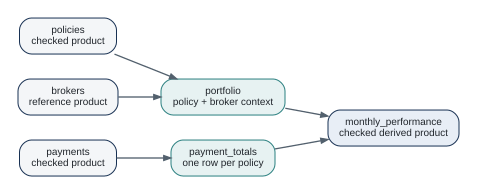

# Multiple Data Products {#sec-composition}

A platform begins to emerge when one checked product can become the explicit input of another.

## Product dependencies

The running insurance example has three source deliveries and several derived products.

{#fig-dependency-graph fig-alt="Policies and brokers feed a portfolio product. Payments feed a payment totals product. Portfolio and payment totals feed monthly performance."}

The arrows represent product dependencies, not necessarily copied files. A dependency may be evaluated in memory, read from a pinned release, or resolved through an adapter.

## Make grain changes visible

Policies have one row per policy. Payments have one row per payment event. Joining raw payments directly to policies would duplicate policy rows when a policy has several payments.

The running project therefore introduces `payment_totals` first:

```r
payment_totals_recipe <- dataraft.core::dr_recipe() |>
  dataraft.core::dr_step_summarise(
    paid = sum(amount),
    .by = policy_id
  )
```

That aggregation changes what one row means. Because the new grain is independently useful to downstream work, it deserves an explicit product boundary.

## Use lookups for meaningful reference dependencies

The portfolio product keeps policy grain while enriching it with broker region.

```r
portfolio_recipe <- dataraft.core::dr_recipe() |>
  dataraft.core::dr_step_lookup(
    brokers,
    by = "broker_id",
    name = "brokers"
  )
```

A lookup is more than a hidden `left_join()` when the reference dataset is part of the product's repeatable dependency graph.

## Products are not steps

Do not turn every transformation into a product. A node deserves product identity when it has at least one durable reason to exist:

- an independent consumer boundary;
- its own grain or contract;
- a different owner;
- a reusable result;
- a separate release lifecycle.

Internal preparation that has no meaning outside one product usually belongs inside its recipe.

## Relational products

Some interfaces are inherently relational. Core supports `dm` model products for related tables and declared relationships. This is useful when flattening would lose meaningful grain or duplicate data.

The same design rule still applies: use a relational product because the relationship is part of the interface, not because a multi-table object looks more sophisticated.

## Execution context and reuse

Within one root execution, shared product dependencies are evaluated once and reused inside that execution context. This is different from durable release caching.

Session-local graph reuse avoids duplicate work in one run. Lake caching is a separate physical feature with stricter reproducibility requirements.

## Draw the graph before adding infrastructure

For the book's project, the graph is intentionally explainable in one sentence:

> policies plus brokers create portfolio; payments create payment totals; portfolio plus payment totals create monthly performance.

If the graph is difficult to explain, a lake, catalog, or orchestrator will not repair the conceptual model.

## Exercises

1. Add a claims delivery with one row per claim. Decide where a policy-grain aggregation should become a new product.
2. Pick one join in an existing analysis and decide whether the result deserves product identity.
3. Explain the difference between shared dependency reuse inside one run and reuse of a durable published release.
