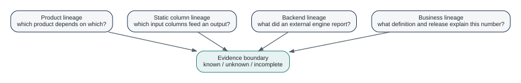

# Lineage: Where Did This Number Come From? {#sec-lineage}

Lineage is not one thing. It is useful to separate at least four forms:

1. product dependency lineage;
2. run or release lineage;
3. column dependency lineage;
4. business interpretation lineage.

{#fig-lineage-layers fig-alt="Four boxes for product lineage, static column lineage, backend lineage, and business lineage point to an evidence boundary labeled known, unknown, and incomplete."}

## Product lineage

If product A is a source of product B, the dependency can be represented without inspecting rows. `dr_lineage()` exposes recorded dataset-level lineage from supported results and backends.

## Column lineage

`dataraft.core::dr_column_lineage()` performs a conservative static analysis of recipe steps. It understands direct dependencies through a limited set of mutate, select, and rename operations. Dynamic selectors, joins, custom functions, row-level dependencies, and opaque transformations can make the result incomplete.

```{.r}
recipe <- dataraft.core::dr_recipe() |>
  dataraft.core::dr_step_mutate(net = gross / 1.19) |>
  dataraft.core::dr_step_select(id, net)

info <- dataraft.core::dr_column_lineage(recipe, c("id", "gross"))
```

If the analysis cannot prove the mapping, it returns `complete = FALSE` and a reason. That is a stronger design than guessing.

## Backend lineage

The dbt integration can read dbt artifact lineage, and lake releases retain product and input relationships. OpenLineage publication is provided by `dataraft.adapters`.

These mechanisms should not be collapsed into one claim of "full lineage." Each source sees a different boundary.

## Business lineage

Knowing that `net` came from `gross` does not explain why the organization calls the result "net premium." Business meaning belongs in descriptions, contracts, metrics definitions, and governance documentation.

::: {.callout-important title="Lineage is evidence, not omniscience"}
A correct lineage system should say when its view is incomplete. Absence of an observed edge is not proof of independence.
:::

## Lineage has several meanings

The question "where did this number come from?" can refer to different evidence.

**Dataset lineage** records which products or sources fed another product. This is the most useful level for understanding a product graph.

**Column lineage** records which input fields contribute to an output field. DataRaft's current static analysis supports a bounded set of recipe transformations and expressions. It refuses to pretend completeness when it encounters an opaque step.

**Release lineage** links a published result to exact retained inputs and output releases. This is essential for reproducibility because "the policies table" is not enough when that table changes every day.

**Business lineage** connects technical fields to business concepts, reports, decisions, and owners. DataRaft can carry metadata that helps this layer, but it is not a complete enterprise business-lineage system.

### Incomplete is an important result

A static lineage analyzer that guesses is worse than one that says "unknown." `dataraft.core::dr_column_lineage()` follows direct field references through supported `mutate`, `select`, and `rename` steps and a small allowlist of pure expressions. Joins, dynamic selectors, custom functions, and unsupported transformations return `complete = FALSE` with a reason.

That behavior should influence how lineage is displayed. An incomplete map is evidence about what DataRaft could prove, not proof that omitted dependencies do not exist.

### External lineage systems

`dataraft.adapters` includes OpenLineage publication and OpenMetadata integration. These are ways to export DataRaft metadata into broader tools, not reasons to duplicate the entire external catalog model inside core. The local product graph remains useful even if no organization-wide lineage service exists.

::: {.callout-tip title="Try it"}
Build a recipe with `mutate(net = gross / 1.19)`, then inspect static column lineage. Add a custom transformation function and inspect it again. The transition from complete to incomplete demonstrates the boundary between evidence and inference.
:::


## Where next

Lineage becomes more valuable when identifiers, owners, descriptions, and contracts are discoverable. The next chapter moves from provenance to metadata and catalogs.

## Exercises

1. Use `dr_column_lineage()` on a recipe containing only `mutate()`, `select()`, and `rename()`. Then add a transformation that makes the analysis incomplete. Compare the result.
2. Draw product-level lineage for the complete insurance project and separately list the column-level questions that product lineage cannot answer.
3. Explain why an incomplete lineage result is stronger evidence than a guessed complete graph.

