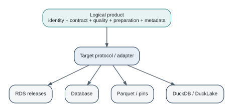

# The Logical and Physical Layers {#sec-logical-physical}

One of the most useful architecture habits is to ask two different questions:

1. What does this data product mean?
2. Where and how is this delivery stored?

The first is logical. The second is physical.

## A logical product

The logical layer contains identity, contract, quality expectations, preparation, dependencies, metadata, policies, and interfaces. These concepts should remain understandable even if storage changes.

## A physical implementation

The physical layer contains RDS directories, database connections, Parquet paths, pins boards, DuckDB files, DuckLake catalogs, S3 buckets, and PostgreSQL registries.

{#fig-logical-physical fig-alt="A logical product containing identity, contract, quality, preparation, and metadata points to a target protocol, which can realize the product as RDS, a database, Parquet or pins, or DuckDB and DuckLake storage."}

Logical data management literature makes a broader version of the same argument: decoupling access and meaning from physical duplication can simplify how users consume heterogeneous data [@gardner2025logical]. DataRaft does not implement an enterprise virtualization layer, but the architectural lesson is still useful.

## Why the distinction matters

If the product is defined only by its physical table, moving storage becomes a semantic migration. If the product meaning is explicit, storage migration is primarily an implementation change, with compatibility tests around the boundary.

This also clarifies what DataRaft does not promise. A database adapter cannot become a distributed transaction merely because the product abstraction is stable. A catalog cannot create column lineage the execution engine did not observe. Logical clarity should expose physical limits, not hide them.

## The logical layer is a promise; the physical layer is a mechanism

A useful way to reason about DataRaft is to ask what would remain true if you moved the data. The product identifier, expected columns, key, quality rules, preparation logic, ownership, and dependencies describe the logical product. A DuckDB file, PostgreSQL connection, RDS directory, Parquet dataset, pins board, or S3 location describes physical realization.

Keeping these concerns separate reduces migration cost, but it does not make physical differences disappear. Lazy execution, transactions, concurrent writers, partition replacement, credentials, and recovery still depend on the backend. Logical independence means those details do not have to leak into every consumer-facing definition.

This idea connects DataRaft to broader logical data management thinking [@gardner2025logical]. Data virtualization, data fabric, semantic layers, and lakehouse systems all separate some form of logical meaning from physical location, but they do so at different levels and with different guarantees. DataRaft's contribution is narrower: an R-native product definition and acceptance workflow that can sit above several physical components.

### A migration thought experiment

Suppose a team begins with versioned RDS releases because the workflow runs on one machine. Later it needs shared release history and moves publication to a DataRaft lake. The consumer-facing contract should not need to be rewritten simply because persistence changed. Tests that assert business expectations should remain relevant. New tests are added for backend behavior, but the product's meaning stays stable.

If moving storage requires rewriting the business definition, the physical layer has probably leaked too far into the logical one.

## Exercises

1. Take the `monthly_performance` product and list its logical properties independently of its current target.
2. Imagine moving its storage from RDS to DuckLake. Identify every consumer-facing promise that should remain unchanged.
3. Name one physical property that *does* affect consumers enough that it should be documented even if it is not part of the logical contract.

