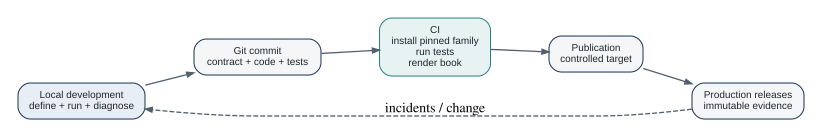

# Development, Testing, and CI/CD {#sec-cicd}

A governed definition is valuable only if changes are checked before they reach consumers.

## Test the layers separately

A practical test pyramid for a DataRaft project is:

1. transformation functions;
2. contract construction and evolution;
3. individual quality rules;
4. product execution with in-memory fixtures;
5. adapter integration against disposable storage;
6. end-to-end publication in the target environment.

The Posit R package testing guidance favors self-contained tests, specific expectations, and clear fixture ownership [@positTesting]. DataRaft's own repositories use `testthat` and include dedicated README-example tests.

## Environment separation

Keep product meaning consistent across development, test, and production. Change connection details, credentials, or targets through configuration rather than changing the contract to match each environment.

A useful environment split is:

{#fig-env-flow fig-alt="A left-to-right flow from local development to Git commit, CI checks, controlled publication, and production releases, with production incidents feeding back into development."}

## GitHub Actions

This book includes `.github/workflows/book.yml` for the book itself. A DataRaft project workflow should typically:

- install the pinned DataRaft family;
- run unit tests;
- execute representative products with `write = FALSE`;
- run disposable adapter integration tests where possible;
- render documentation;
- publish only from an approved branch or release process.

## Reproducibility limits

A hash can prove that bytes changed. It cannot prove that an external API returned the same logical content next month. A replay can reproduce a pure R transformation. It cannot reproduce an unavailable external service.

DataRaft's code reflects this distinction through fingerprintability, volatile rules, pinned releases, and explicit backend evidence. Keep the same discipline in CI design.

## Test definitions before testing infrastructure

A reliable CI pipeline begins with small deterministic tests. Test a contract constructor without a database. Test a quality rule against a tiny data frame. Test a recipe against a local fixture. Then add adapter and lake integration tests where the external guarantee matters.

This follows the same testing shape used by the DataRaft repositories themselves. Core has focused tests for contracts, recipes, diagnostics, execution configuration, governance, and current API shape. Component repositories own their adapter-specific tests. README examples are also executed in tests so that the first copied example cannot silently drift away from the package.

### Three useful scales

**Micro tests** validate one definition or rule. They should be fast and easy to diagnose.

**Mezzo tests** combine a product, preparation, contract, and quality rules against representative synthetic data. These catch mismatches between components.

**Macro tests** exercise a real adapter, local lake, dbt executable, external metadata service, or IDE host. They provide valuable confidence but should not be the only place business rules are tested.

### CI should prove the book too

This book includes a workflow that installs R, Quarto, DataRaft development packages, renders the book, and treats executable examples as part of the build. That is important because prose can become stale even when package tests stay green.

A production project can apply the same principle:

```yaml
- name: Check product definitions
  run: Rscript -e 'testthat::test_dir("tests/testthat")'

- name: Render operational documentation
  run: quarto render
```

The exact workflow depends on how packages are installed and which external services are available. Keep credentials out of examples and split optional infrastructure tests from the local learning path.

### Environment promotion is not data copying by definition

Development, test, and production environments often need different connections while sharing the same logical definitions. Store connection-free configuration in the product where possible and inject environment-specific destinations at execution or deployment time. This lowers the risk that a development path or credential becomes part of the product identity.

For regulated or high-impact workflows, add explicit promotion controls outside DataRaft as required. A passing package check is evidence about software quality, not an approval by itself.

## Exercises

1. Split the complete project tests into definition, behavior, and persistence tests. Which failures should be fastest to diagnose?
2. Add one CI check that deliberately uses a malformed delivery. Explain why testing the failure path is as important as testing the happy path.
3. Design a promotion rule from development to production that refers to verified artifacts and evidence rather than to a developer's local session.

