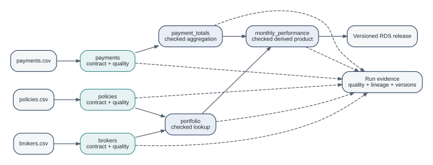

# Building a Small Data Platform {#sec-small-platform}

The earlier chapters treated one concept at a time. This chapter puts the pieces together in a project that is intentionally small enough to understand without a platform team, yet structured enough to behave like a platform rather than a folder of scripts.

The complete runnable project is in `examples/insurance-platform/`. It uses only local files and versioned RDS output, so it needs no database, object store, catalog service, or credentials. The book's CI runs the example tests before rendering the book.

{#fig-complete-platform fig-alt="Three CSV inputs become checked policies, brokers, and payments products. Policies and brokers feed a portfolio product, payments feed a payment totals product, both feed monthly performance, and the accepted final result is published as a versioned RDS release with run evidence."}

## Start from product boundaries, not folders

The project contains three source deliveries:

- `policies.csv`, one row per policy;
- `brokers.csv`, one row per broker;
- `payments.csv`, one row per payment event.

The first architectural decision is not where these files will be stored. It is what reusable products they represent and at what grain.

The project therefore defines five logical products:

| Product | Grain | Main responsibility |
|---|---|---|
| `policies` | one row per policy | policy interface and policy checks |
| `brokers` | one row per broker | broker reference data |
| `payments` | one row per payment event | payment event interface and checks |
| `portfolio` | one row per policy | policies enriched with broker region |
| `payment_totals` | one row per policy | payment events aggregated to policy grain |
| `monthly_performance` | one row per policy | portfolio joined to payment totals with an outstanding amount |

This table is more important than the directory tree. Once the grains are explicit, the joins and contracts have something stable to protect.

## The project layout

```text
examples/insurance-platform/
  R/
    products.R
  tests/testthat/
    test-platform.R
  releases/
  run.R
  README.md
```

The input fixtures remain in the book-level `data/` directory so the same synthetic data can be used by earlier chapters.

The entire product graph is constructed by one function:

```r
source("examples/insurance-platform/R/products.R")
products <- insurance_products(".")
```

Construction defines objects and source locations. The file sources are read only when a product executes. That distinction lets tests inspect and validate definitions without turning every constructor into an I/O operation.

## Step 1: make the source products explicit

The policy product demonstrates the basic pattern used throughout the project. The contract carries identity and shape. Business metadata and validation policy are composed separately. Quality rules state acceptance decisions.

```r
policies_contract <- dataraft::dr_contract(
  "policies",
  columns = c(
    policy_id = "integer",
    broker_id = "integer",
    premium = "numeric",
    status = "character"
  ),
  key = "policy_id"
) |>
  dataraft.core::dr_contract_meta(
    owner = "Risk Analytics",
    grain = "One row per policy"
  ) |>
  dataraft.core::dr_contract_policy(allow_extra = FALSE)
```

The source is a deferred file source rather than an eagerly loaded data frame:

```r
policies_source <- dataraft.core::dr_source_file(
  "source.policies",
  "data/policies.csv",
  reader = utils::read.csv
)
```

The product then composes source, contract, and quality:

```r
policies <- dataraft::dr_product("policies", policies_source) |>
  dataraft::dr_add_contract(policies_contract) |>
  dataraft::dr_add_quality(dataraft.core::dr_quality_rule(
    "premium_non_negative",
    ~ premium >= 0,
    action = "block"
  ))
```

`brokers` and `payments` follow the same pattern. This repetition is deliberate. Each source product has its own identity, grain, owner, and acceptance rules.

## Step 2: change grain before joining

Payments are event data. Policies are entity data. Joining them directly would change the policy grain whenever a policy has multiple payments.

The platform therefore creates `payment_totals` first:

```r
payment_totals_recipe <- dataraft.core::dr_recipe() |>
  dataraft.core::dr_step_summarise(
    paid = sum(amount),
    .by = policy_id
  )

payment_totals <- dataraft::dr_product("payment_totals", payments) |>
  dataraft::dr_add_contract(payment_totals_contract) |>
  dataraft.core::dr_add_recipe(payment_totals_recipe) |>
  dataraft::dr_add_quality(~ paid >= 0)
```

This is a small example of a general rule: **make grain changes visible as product boundaries when consumers rely on the new grain**. The aggregation is not merely an implementation detail. It changes what one row means.

## Step 3: enrich policies without hiding the dependency

`portfolio` starts from the checked `policies` product and uses `brokers` as a named lookup dependency:

```r
portfolio_recipe <- dataraft.core::dr_recipe() |>
  dataraft.core::dr_step_lookup(
    brokers,
    by = "broker_id",
    name = "brokers"
  )

portfolio <- dataraft::dr_product("portfolio", policies) |>
  dataraft::dr_add_contract(portfolio_contract) |>
  dataraft.core::dr_add_recipe(portfolio_recipe) |>
  dataraft::dr_add_quality(~ nzchar(region))
```

The result is still one row per policy. The contract states that `region` is now part of the product interface. The lookup is recorded as preparation rather than buried inside an anonymous script.

A common alternative is to load two tables at the top of a script and call `left_join()`. That may be completely appropriate for a one-off analysis. The product form becomes useful when the dependency and resulting interface need to survive beyond the script that created them.

## Step 4: compose the final product

The final `monthly_performance` product uses `portfolio` as its main input and `payment_totals` as a lookup. A missing payment is permitted, because not every policy must have a payment event in the fixture. Missing totals are converted to zero before the outstanding amount is calculated.

```r
performance_recipe <- dataraft.core::dr_recipe() |>
  dataraft.core::dr_step_lookup(
    payment_totals,
    by = "policy_id",
    name = "payment_totals",
    unmatched = "keep"
  ) |>
  dataraft.core::dr_step_mutate(
    paid = dplyr::coalesce(paid, 0),
    outstanding = premium - paid
  )
```

This recipe also demonstrates a useful lineage boundary. The current static column-lineage analyzer understands a conservative set of transformations. An expression such as `dplyr::coalesce()` can make static column lineage incomplete. DataRaft reports that incompleteness rather than guessing. Product-level dependency lineage remains meaningful even when static column-level evidence is partial.

## Step 5: check before writing

The first complete run stays in memory:

```r
checked <- dataraft::dr_run(
  products$monthly_performance,
  write = FALSE,
  stop_on_failure = FALSE
)

checked$status
dataraft::dr_quality_report(checked)
output <- dataraft::dr_collect(checked)
```

For the shipped fixtures the expected status is `completed`. If a contract or quality rule blocks the delivery, the result remains diagnostic evidence and `dr_collect()` will not treat it as accepted output.

This separation is the core safety property of the example. Writing is not the way you discover whether a delivery was valid. Validation and quality happen before a durable target is committed.

## Step 6: add the smallest durable target

The local example uses the RDS adapter because it requires no external service:

```r
release_root <- "examples/insurance-platform/releases/monthly-performance"

published <- products$monthly_performance |>
  dataraft::dr_set_target(
    dataraft.adapters::dr_target_rds(release_root)
  ) |>
  dataraft::dr_publish()
```

Each successful RDS write creates a new version directory and checksum metadata. Existing versions are not overwritten by the adapter. This is local filesystem versioning, not a database transaction or a distributed lock service. The distinction is documented by the adapter itself.

A later move to `dataraft.lake` changes the physical release mechanism and adds registry, lifecycle, recovery, and integrity features. It does not require redefining what `monthly_performance` means.

## Step 7: test behavior, not only syntax

The example contains three tests:

1. the complete graph returns a checked `monthly_performance` result;
2. a negative policy premium is blocked before reuse;
3. RDS publication creates a version that can be read back.

The first is a mezzo test: several definitions execute together using local fixtures. The second targets the acceptance decision directly. The third tests the persistence boundary with disposable storage.

This follows the Posit testing guidance used in this project: keep tests self-contained, use temporary paths for side effects, and assert specific behavior rather than relying on one large end-to-end test [@positTesting].

Run them from the book root with:

```sh
Rscript scripts/verify-examples.R
```

## What makes this platform-shaped?

Nothing in this chapter is large. There is no cluster, scheduler, data catalog, or cloud account. Yet the project already has platform-like properties:

- recurring deliveries have stable identities;
- row grain is explicit;
- producer expectations are executable;
- business checks determine acceptance;
- dependencies are visible as product relationships;
- storage is replaceable behind a target boundary;
- failures return diagnostic evidence;
- durable releases are versioned rather than silently overwritten;
- the same definitions are testable in CI.

That is enough to support a team more safely than a collection of unrelated scripts.

## What to add next

Add infrastructure only when a concrete operating requirement appears.

Use `dataraft.lake` when shared release history, recovery, integrity verification, lifecycle state, or lake-backed access is needed. Use OpenMetadata or OpenLineage integration when the organization already has a metadata plane. Use output ports when one accepted delivery really needs multiple destinations. Use policies and SLAs when there is an actual organizational rule or delivery promise to enforce.

The next chapter tests the same product model against change. That is where contracts and explicit dependencies start to earn their cost.

::: {.callout-tip title="Try it"}
Copy `data/policies.csv`, set one premium to `-1`, and point the policy source at the modified file. Predict which rule will fail and which downstream products will become unavailable before running the tests.
:::

## Exercises

1. Add a `claims` source product at one row per claim. Decide whether the first reusable downstream product should stay at claim grain or aggregate to policy grain.
2. Replace the final RDS target with a temporary lake target if DuckDB is available. Keep the logical product definition unchanged and compare the resulting release evidence.
3. Add a fourth test that asserts the final product grain remains one row per policy after all lookups.

