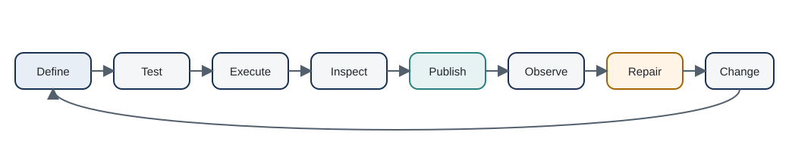

# Operating the Platform {#sec-operating}

A data product is not finished when its code is merged. Recurring products need a routine for running, observing, diagnosing, publishing, repairing, and changing them without losing the evidence that explains what happened.

DataRaft provides pieces of that routine. It does not provide a scheduler, incident-management system, or universal observability platform. Those boundaries are useful: an orchestrator can decide **when** work runs while the DataRaft product decides **what counts as an acceptable delivery**.

## The operating loop

For a recurring product, a practical loop is:

```text
define -> test -> execute -> inspect -> publish -> observe -> repair -> change
```

{#fig-operating-loop fig-alt="A loop from define to test, execute, inspect, publish, observe, repair, and change, then back to define."}

The loop is deliberately broader than `dr_run()`. Some steps are product code, some are CI, and some belong to external operations.

### Define

A definition should be inspectable without running the source. Product identity, contract, preparation, policies, ports, and target configuration should make the expected behavior legible.

Use `dr_inspect()` when reviewing a definition programmatically. Keep business metadata close enough to the contract that ownership and grain do not depend on a separate slide deck.

### Test

Before a scheduled execution reaches a durable target, CI should prove the local behaviors that do not require production infrastructure. For the running example that means at least:

- contracts construct successfully;
- known bad fixtures are blocked;
- the complete product graph succeeds on known good fixtures;
- dataset lineage is present for the root result;
- the publish policy passes;
- the output port publishes and records SLA evidence;
- the local RDS target can read the exact created release.

External adapter tests can be separate jobs because credentials and service availability have different failure modes from product logic.

### Execute

Use `dr_run(write = FALSE)` when the goal is to evaluate the product without a configured writer. Use ordinary `dr_run()` when the definition already has a target and writing is intended. Use `dr_publish()` when publication is the explicit action and a destination is required.

Keep `stop_on_failure = TRUE` for unattended jobs unless the surrounding code deliberately captures failed results. Interactive diagnosis often uses `stop_on_failure = FALSE` so the result can be inspected directly.

### Inspect

Start from status and the quality report, then move toward rows or errors only when needed.

```r
result$status
dataraft::dr_quality_report(result)
dataraft.core::dr_quality_rows(result, limit = 20)
dataraft.core::dr_quality_errors(result)
```

`dr_last_failure()` is convenient inside one R session, especially after a piped operation raises. It is not durable run history. Production operations should retain run or release evidence in a system appropriate to the deployment.

### Publish

Publication should be conditional on acceptance, not simply on process exit code. A successful write should return enough output metadata to identify what was committed.

For versioned backends, downstream reproducibility should prefer exact release identity over resolving "latest" after the fact. A current dashboard may intentionally use the newest accepted release. A frozen regulatory or management report should retain the exact input release it used.

### Observe

Observation has several layers:

- **execution status**: did the attempt complete, block, or error?
- **validation status**: were checks passed, warning, failed, or unvalidated?
- **delivery status**: was a target actually published?
- **freshness/SLA**: did the accepted delivery arrive when promised?
- **integrity**: can a retained release still be verified?
- **dependency health**: are upstream products available and accepted?

Do not collapse all of these into one green/red flag. A product can execute correctly and still miss an SLA. A release can pass business quality and later fail an integrity check because files changed. Different questions need different evidence.

## A minimal operator checklist

For a recurring product, an operator should be able to answer:

1. Which product definition and version ran?
2. Which inputs or upstream releases were used?
3. What was the run status?
4. Which checks warned or blocked?
5. Was anything published?
6. What release or output identifier was created?
7. Did every required output port succeed?
8. Was the delivery on time?
9. Is the published release still verifiable?
10. What changed since the previous accepted delivery?

Not every backend can answer every question. The gap should be explicit rather than filled with assumptions.

## Separate incidents from failed checks

A failed quality check is evidence about a delivery. An incident is an operational process around that evidence.

For example, a negative premium may block `policies`. That does not tell you whether the organization wants to open an incident, retry automatically, wait for the producer, quarantine rows, or accept a warning under an approved exception process.

Keep the product decision and the incident process connected but distinct. This prevents business-quality logic from becoming entangled with ticketing APIs or notification systems.

## Retry only the boundary that failed

Retries are safest when they respect the stage that failed.

If a source API timed out before a candidate existed, retry source acquisition according to the adapter's semantics. If a deterministic quality rule blocked a real data defect, retrying the same bytes will not help. If a secondary output port failed after the primary committed, retry only the unpublished ports using the retained result where current core support allows it.

A generic "retry the job three times" policy can hide these differences and produce duplicate side effects.

## Operations with a lake

`dataraft.lake` adds richer durable operations than the local RDS adapter. Verified current capabilities include release history, registry metadata, lifecycle state, recovery for interrupted work, integrity verification, comparison, cleanup, and backfill support.

That does not remove the need for external scheduling or monitoring. It gives those systems a stronger product state to observe.

A useful division of responsibility is:

| Concern | DataRaft | External system |
|---|---|---|
| product definition | yes | version control stores it |
| contract and quality decision | yes | may display outcome |
| release identity/evidence | yes for supported targets | may index or alert |
| schedule | no | orchestrator / CI / scheduler |
| credentials | not embedded in definitions | secret manager / environment |
| incident workflow | no | ticketing / on-call tooling |
| organization catalog | adapter integration | metadata platform |

## Metrics and frozen reports

The experimental `dataraft.metrics` package extends the operating story for retained measures and reports. Its README explicitly avoids claiming to be a general semantic layer. It records metric definitions, checked inputs, resulting values, and replay/integrity evidence for supported workflows.

That boundary matters operationally. A frozen report needs to answer "which accepted release and metric definition produced this value?" It does not necessarily need a universal query-time semantic system.

Use the experimental metrics component only when that narrower evidence problem matches the requirement, and expect its API to evolve faster than core.

## IDE tooling is an operator convenience, not the source of truth

The experimental `dataraft.ide` bridge and the optional Positron extension expose bounded product, quality, run, release, and lineage metadata to the editor. They can make diagnosis faster for a developer working in an R session.

The extension does not publish data automatically, and its views should not become the only place operational meaning exists. Definitions and durable evidence remain in R objects, package code, and configured storage.

## A weekly maintenance rhythm

A small team can operate DataRaft without building a control plane on day one. A lightweight rhythm might include:

- review blocked or warning deliveries;
- verify that scheduled products published expected releases;
- check SLA evidence for products with explicit promises;
- review repeated quality failures for rules that may no longer match business reality;
- verify selected retained releases;
- review pending product or contract changes and their downstream impact;
- retire products that should no longer accept new releases.

The important point is that each review item has a concrete evidence source. In the companion project, the run result answers quality and lineage questions, `port_outputs` records the declared delivery boundary, `metadata$policies` records the publish decision, `metadata$sla` records delivery evidence, and the RDS release identifier anchors the physical output. The meeting should not depend on reconstructing what happened from console logs.

## What DataRaft still delegates

A broader production platform may still need:

- scheduling and dependency triggers;
- workload isolation and resource management;
- secret distribution;
- distributed computation;
- centralized logs and metrics;
- enterprise access control;
- organization-wide incident management;
- data retention enforcement outside the product process.

DataRaft can participate in those systems through adapters and standard operational patterns, but it should not claim ownership of guarantees it does not implement.

## The operating principle

The product definition says what should be true. A run records what happened. A target records what was committed. Operations connect those facts to human action.

That separation keeps a small platform understandable while leaving room for more infrastructure later. Part VII closes the book by extracting the design principles behind that approach and by making the boundary explicit: there are many situations where DataRaft should not be the primary tool.

## Exercises

1. Write a runbook for one missed monthly delivery: detection, diagnosis, correction, rerun, publication, and communication. Attach a DataRaft object or evidence function to each step where possible.
2. Decide which failures in your environment should page an operator immediately and which should become a warning or backlog item.
3. Define three operational metrics for the platform itself, such as delivery timeliness or blocked-run rate. State which are currently available from DataRaft evidence and which require external monitoring.

